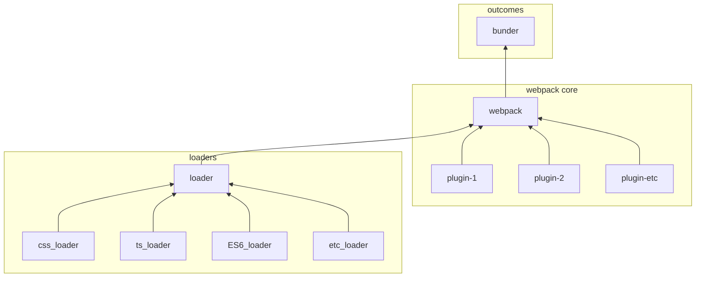

# webpack_start_kit

```mermaid

graph BT
    loader-->webpack
    webpack-->bunder

    subgraph loaders
    css_loader --> loader
    ts_loader-->loader
    ES6_loader-->loader
    etc_loader-->loader
    end
    
    subgraph webpack core
    plugin-1-->webpack
    plugin-2-->webpack
    plugin-etc-->webpack
    end
    
    subgraph outcomes
    bunder
    end


```

- Loaders are just to assit webpack to load all kinds type of files.
- Plugins are for strengthen the capbility of webpack to do more things.